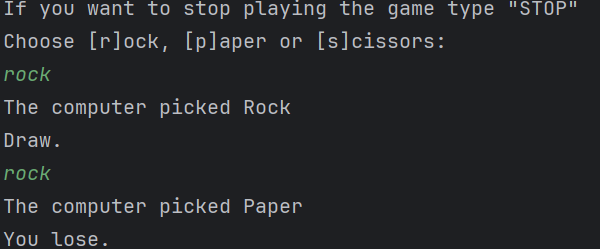
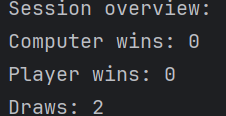

# Rock-Paper-Scissors-Project
This is a simple project made with Java , based on the popular game Rock-Paper-Scissors. A player will compete against the computer.

The player makes his move by typing it on the console.After that the computer will randomly choose its move and the program will decide 
who is the winner.If the game is a draw the program will print "Draw". 

The game will restart automatically until the player types in the command "Stop".
In the end of a game session the program will print out the statistics of the session:

There is also a feature where the computer/player's chances of a win increase depending on
consecutive win either for the player or the computer. Meaning if the player has 3 consecutive wins 
the computer's chances of a win increase.